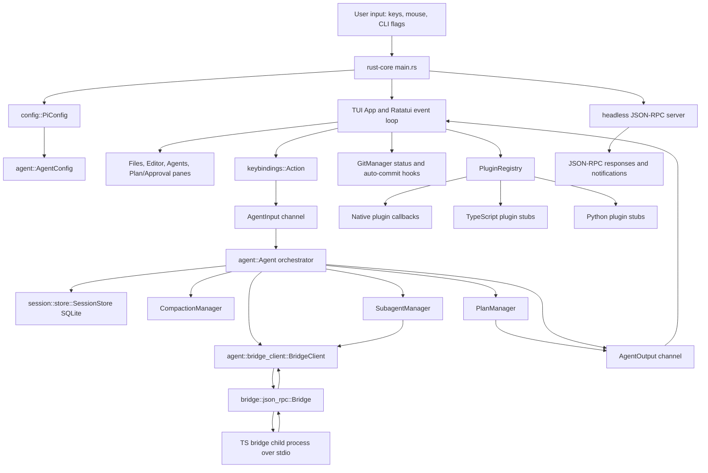

# Pi Hybrid Architecture

This document maps the active workspace for the B7 Architecture Map checkpoint
in `docs/roadmap-b7-b10.md`. It describes the code as it exists now, including
scaffolded seams that are not yet wired into the main runtime path.

## Workspace Shape

The workspace is a small Rust-first hybrid runtime:

| Path | Responsibility |
| --- | --- |
| `rust-core/` | Main binary. Owns CLI startup, config, TUI, agent orchestration, bridge client, sessions, plans, subagents, plugins, git status, and shutdown. |
| `ts-bridge/` | Synchronous JSON-RPC-over-stdio client for a TypeScript child process. It defines the bridge protocol types and skill/prompt helpers. |
| `py-extensions/` | Placeholder Python extension crate. It currently contains only the default sample function and tests. |
| `rust-core-temp/` | Reference checkout for future patterns. It is not part of the active workspace members. |
| `tests/` | External smoke tests, currently a pseudo-terminal TUI smoke test. |
| `docs/` | Project docs. |

The active workspace members are declared in the root `Cargo.toml`:
`rust-core`, `ts-bridge`, and `py-extensions`.

## Runtime Entry Points

`rust-core/src/main.rs` is the binary entry point.

Startup flow:

1. Parse CLI flags: `--headless`, `--config <PATH>`, `--init-config`,
   `--validate-config`, and `--log-level <LEVEL>`.
2. Load `PiConfig` from `~/.pi-hybrid/config.toml` or `--config`, then apply
   environment overrides.
3. Initialize tracing.
4. If `--headless` is present, run `headless::run_headless()`.
5. Otherwise enter alternate-screen terminal mode and start the Ratatui event
   loop.

Interactive mode creates `App`, which owns UI panes, registries, git state,
bridge status, a Tokio runtime, and channels to the agent task.

Headless mode is implemented separately in `rust-core/src/headless.rs`. It is a
JSON-RPC server over stdin/stdout with methods such as `run`, `status`,
`cancel`, `list_sessions`, `resume`, and `shutdown`. Its `run` handler currently
simulates agent work instead of calling the main agent loop.

## Data Flow



The important boundary is the TUI-agent channel pair:

| Direction | Type | Meaning |
| --- | --- | --- |
| TUI to agent | `AgentInput` | User prompts, plan approval/rejection/edit, cancel, spawn subagent, query subagents, shutdown. |
| Agent to TUI | `AgentOutput` | Response chunks, plan updates, step status, subagent status/results, errors, thinking/idle markers, diff previews. |

## Crate Responsibilities

### `rust-core`

`rust-core` is the product surface and orchestration layer.

Key modules:

| Module | Responsibility |
| --- | --- |
| `main.rs` | CLI parsing, config loading, tracing setup, terminal lifecycle, TUI event loop, app state, command execution. |
| `config.rs` | TOML config loading, env overrides, validation, default config generation, conversion to `agent::AgentConfig`. |
| `keybindings.rs` | Keyboard/mouse events to semantic `Action` values. |
| `tui/` | Ratatui panes, status bar, command palette, help popup, Mermaid preview, semantic diff view, display toggles. |
| `agent/mod.rs` | Main TUI-facing agent orchestrator. Owns bridge, SQLite session store, plan manager, subagent manager, compaction manager, and channel processing. |
| `agent/bridge_client.rs` | Async wrapper around the raw JSON-RPC bridge, with prompt, stream, cancel, skills, compaction, provider, timeout, and reconnect methods. |
| `bridge/json_rpc.rs` | Low-level async JSON-RPC-over-stdio child process wrapper. |
| `session/store.rs` | Active SQLite session store used by `agent/mod.rs`. Stores sessions and messages. |
| `agent/plan.rs` | Rich plan lifecycle for review, approval, step status, and TUI display. |
| `agent/plan_exec.rs` | Smaller separate execution-plan abstraction using tool calls. |
| `agent/tool.rs` | Tool schema, parsed tool calls, and stubbed tool execution. |
| `agent/plugins.rs` | Unified plugin trait and registry for native, TypeScript, and Python backends. Manifest discovery is present but backend calls are currently stubs. |
| `agent/providers.rs` | Provider registry with built-in DeepSeek and GLM definitions. |
| `agent/subagents.rs` | TUI-facing Tokio subagent manager using shared bridge access and cancel tokens. |
| `agent/subagent.rs` | Separate smaller subagent pool around `agent_core::Agent`. |
| `agent/compaction.rs` | Token estimation and local compaction bookkeeping. Bridge-backed summarization is planned but not wired into the active prompt path. |
| `agent/git.rs` | Git status display, file snapshots, and auto-commit support. |
| `headless.rs` | Standalone headless JSON-RPC server stub. |
| `shutdown.rs` | Cancellation token and signal watching. |

There are several scaffolded or parallel implementations. The active TUI path
goes through `agent/mod.rs`, `session/store.rs`, `agent/plan.rs`,
`agent/subagents.rs`, and `agent/bridge_client.rs`.

### `ts-bridge`

`ts-bridge` provides a blocking JSON-RPC stdio client for TypeScript-side Pi
skills. It defines:

- JSON-RPC request/response/error types.
- Skill metadata and `call_skill` argument/result types.
- Prompt and streaming token types.
- `TsBridge`, which spawns a child command and sends one JSON-RPC request per
  line.

This crate is optional in `rust-core` behind the `typescript` feature. The
active `rust-core` bridge path currently uses its own async bridge wrapper in
`rust-core/src/bridge/json_rpc.rs`.

### `py-extensions`

`py-extensions` is a placeholder crate. `rust-core` depends on it optionally via
the `python` feature, but no Python runtime integration is currently exposed
from this crate.

## Design Decisions

- **Rust owns the shell.** The terminal UI, event loop, config, persistence,
  and orchestration live in `rust-core` for low memory use and fast startup.
- **Bridges are process boundaries.** TypeScript integration is designed as
  JSON-RPC over stdio. This keeps the Rust binary independent from Node runtime
  details and lets a bridge process fail without directly corrupting Rust
  state.
- **The TUI talks to the agent through channels.** `AgentInput` and
  `AgentOutput` isolate UI handling from async agent work. The TUI polls output
  without blocking the render loop.
- **Config is validated before runtime.** `PiConfig::load` merges defaults,
  file config, and env overrides, then validates provider names, API key env
  vars, session DB path, max turns, and default model.
- **SQLite is the persistence target.** The active session store creates a
  local SQLite DB and persists sessions/messages under the configured path.
- **Plan approval is first-class.** Plans have explicit pending, approved,
  rejected, executing, completed, and failed states. File-edit steps can produce
  diff summaries for review.
- **Subagents share bridge access.** TUI-facing subagents run as Tokio tasks and
  share an `Arc<Mutex<BridgeClient>>`, which keeps concurrency simple but
  serializes bridge calls.
- **Git is integrated into the UI surface.** Git status is shown in the status
  bar, and auto-commit support exists for plan approval. This should stay
  conservative because it can create commits from UI actions.
- **Feature flags keep optional runtimes out of the default build.**
  `python` and `typescript` features opt into `py-extensions`, `pyo3`, and
  `ts-bridge`.

## Current Gaps and Sharp Edges

- The active `Agent::process_prompt` path stores the user message and returns a
  status response; it does not yet send the prompt through `BridgeClient`.
- Headless mode is separate from the TUI-facing agent and currently simulates
  work.
- There are duplicate/parallel modules for agent, session, plan, and subagent
  concepts:
  - `agent/mod.rs` vs. `agent/agent_core.rs` and `agent/loop.rs`
  - `session/store.rs` vs. `agent/session.rs`
  - `agent/plan.rs` vs. `agent/plan_exec.rs`
  - `agent/subagents.rs` vs. `agent/subagent.rs`
- Plugin discovery can read `plugin.toml`, but TypeScript and Python plugin
  execution are stubbed callbacks.
- `tools/mod.rs` is empty, while `agent/tool.rs` contains the active tool-call
  placeholder.
- The default config validates built-in provider API env vars. Local or test
  configs need `api_key_env = "none"` or the matching env vars set.

## Extension Points

Use these seams for future work:

| Extension | Start Here | Notes |
| --- | --- | --- |
| New TUI command | `tui/command_palette.rs`, `keybindings.rs`, `App::execute_command` | Add a command enum value, key mapping if needed, and one handler branch. |
| New pane or visual state | `tui/mod.rs`, `main.rs::layout_for`, `main.rs::draw` | Keep pane state inside `App`; render through a focused `tui/*` module. |
| Real prompt execution | `agent/mod.rs::process_prompt`, `agent/bridge_client.rs` | Build `PromptParams`, call `send_prompt`, persist assistant messages, emit `AgentOutput`. |
| New bridge method | `bridge/json_rpc.rs`, `agent/bridge_client.rs`, `ts-bridge/src/lib.rs` | Keep protocol structs serializable and method names consistent across Rust and TS. |
| New provider | `config.rs`, `agent/providers.rs` | Decide whether it belongs in config defaults, runtime registry, or both. |
| Tool execution | `agent/tool.rs`, `agent/plan_exec.rs`, `agent/plan.rs` | Replace the stub executor with safe tool dispatch and approval-aware file edits. |
| Plugin backend | `agent/plugins.rs` | Implement backend-specific calls behind the `Plugin` trait and preserve manifest discovery. |
| Session import/export | `agent/session.rs` or `session/store.rs` | Pick one store as canonical before expanding persistence behavior. |
| Context compaction | `agent/compaction.rs`, `agent/bridge_client.rs` | Wire compaction to real conversation history and bridge summarization. |
| Headless parity | `headless.rs`, `agent/mod.rs` | Route JSON-RPC methods into the same agent/session path used by the TUI. |
| Subagent execution | `agent/subagents.rs` | Replace placeholder loop behavior with bounded prompt/tool execution and status updates. |
| Git safety | `agent/git.rs`, plan approval handlers in `main.rs` | Any auto-commit or revert behavior should stay explicit and test-covered. |

## Verification Targets

Useful lightweight checks after architecture or small code changes:

```sh
cargo test --workspace
python3 tests/tui_smoke.py
cargo run -p rust-core -- --validate-config --config <test-config.toml>
```

For docs-only changes, a targeted verification can be:

```sh
test -f docs/architecture.md
rg -n "flowchart TD|Crate Responsibilities|Extension Points" docs/architecture.md
```
